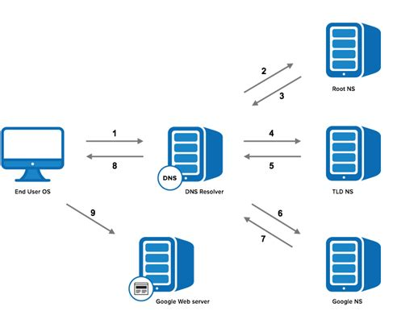

# DNS

**DNS**: Domain Name System

* Humans cant remember IP addresses, they can remember names 
* Machines communicate using IP addresses 
* Thus a system to translate Names to IP and via-a-versa

This is how a Name is resolved to IP addresses \(consider pi.co\)

* On a request to translate a name to an IP address 
* The machine checks its Cache \(hosts files\), if the entry is present, resolved IP is provided  
* The machine checks with the recursive DNS server \(usually hosted by ISPs\). The recursive server are responsible for providing the IP address for the requested name. 
* The recursive server checks the name at its local files, if not found, it contacts the root server. 
* The root server responds back with the IP for the TLD server
* The recursive server then send the resolution request to the TLD server 
* TLD server responses with the authoritative server for the domain name 
* Recursive server then sends the request to authoritative server
* The authoritative server responds back with the name server for the domain
* Recursive server queries the Name server for the domain
* The Name server for the domain finally shares the IP address corresponding to the domain. 

| Client |   | Recursive Server |   | Other Servers |
| :--- | :--- | :--- | :--- | :--- |
| Resolve pi.co  | → | I don't have pi.co, hold on |   |   |
|   |   | Do you have pi.co  | → | **Root Server**: No I don't |
|   |   |   | ← | I have co, ask co |
|   |   | Hi Co, do you have pi.co  | → | Co Server: No I don't |
|   |   |   | ← | I have NS for pi.co, ask NS |
|   |   | Hi NS, do you have pi.co | → | Sure I do |
|   |   |   | ← | here is pi.co |
| Thanks | ← | Here is pi.co |   |   |

### Some definitions

**Hostname/Domain Name**: Names given to machines

**TLD**: Top Level Domain, e.g. com, net, org, etc.

**Resolver**: The recursive server, which sends requests to other DNS servers

**Root DNS**: The server which has addresses for TLDs

**Authoritative Server**: The server which is an authority on for the zone files corresponding to the domain

**DNS Zone**: A region/ namespace maintained by a single server/ organization/ administrator. Example root zone \(containing info for root server and TLDs\)

**Zone files**: Files containing the Name to IP mapping with some more information. 

**DNSSec**: A security feature that encrypts the data stored in the zone files. Uses public key encryption, which also allows the resolver to verify the authenticity of the records received. 

**Chain of Trust**: Encryption only doesn't ensure authenticity, thus the resolver needs to verify the authenticity of the public key. This is achieved by chain of trust, the public key issued by AS is signed by the private key of TLD and TLD's public key is signed by the root server's private key. The public key for the root servers is stored with the resolver thus building an implicit trust between the keys. 

